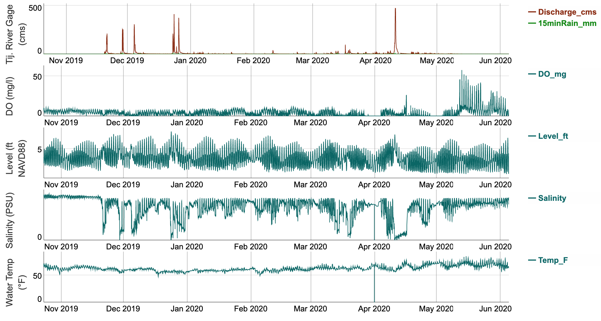

# TijuanaRiverWQweb
Website for viewing water quality data at Tijuana River Estuary

Uses Dygraphs javascript library to provide stacked, interactive and synchronized charts for each water quality parameter recorded at the site.

Stacked Graphs example:

Issues:
- Various css issues related to legend 
- Large datasets (over a year) results in very long load
- Dygraphs library used was edited and no longer reflects repo version @ https://github.com/danvk/dygraphs
